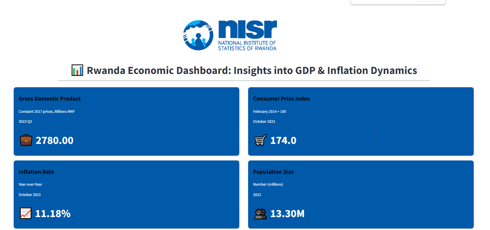

# NISR Data Science Interactive Dashboard

Welcome to the NISR Data Science Hackathon repository! This repository contains code, data, and other resources for the NISR Data Science Hackathon built by DataDynamo team.

## Table of Contents

- [Overview](#overview)
- [Features](#features)
- [Getting Started](#getting-started)
- [Screenshot](#screenshot)
- [Data Used](#data-used)
- [Dashboard Information](#dashboard-information)
- [How to Interact](#how-to-interact)
- [Contributing](#contributing)
- [Authors](#authors)
- [License](#license)

## Overview

This project presents an interactive dashboard that provides in-depth insights into GDP (Gross Domestic Product) and CPI (Consumer Price Index) trends. Designed to aid economic analysts, policymakers, and business strategists, the dashboard offers a comprehensive view of crucial economic indicators and their implications.

## Features

- Interactive GDP Analysis: Explore GDP growth trends over time, with detailed visualizations highlighting sector-wise contributions.
- CPI Trend Examination: Delve into CPI changes, understanding inflation and its impact on the economy.
- Data-Driven Insights: Gain valuable insights from processed and well-presented economic data.
- User-Friendly Interface: Navigate through an intuitive and accessible dashboard layout.
- Responsive Design: Access insights on multiple devices, ensuring a seamless experience.

## Getting Started

1. Clone this repository to your local machine:

   ```bash
   git clone https://github.com/Makuo67/NISR_Datathon.git
   ```

2. Create Virtual Environment:

   ```bash
   python -m venv venv
   ```

3. Activate Virtual Environment:
   - On Windows:
   ```bash
   venv\Scripts\activate
   ```
   - On Unix or MacOS:
   ```bash
   source venv/bin/activate
   ```
4. Install dependencies:
   ```bash
   pip install -r requirements.txt
   ```
5. Run App:
   ```bash
   streamlit run myapp.py
   ```

## Screenshot



## Data Used

Our interactive dashboard relies on two primary datasets: Gross Domestic Product (GDP) data and Consumer Price Index (CPI) data. These datasets, sourced from NISR, serve as the foundation for our visualizations and analyses, offering a comprehensive view of Rwanda's economic landscape in 2022.

## DashBoard Information

The dashboard aims to communicate key insights derived from the GDP and CPI datasets. Through visually compelling charts and graphs, users can explore trends, sectoral breakdowns, and global comparisons, gaining a deeper understanding of Rwanda's economic performance in 2022.

## How to Interact

1. **GDP Overview:** Explore the economic heartbeat of Rwanda, analyzing major contributors to GDP growth and sectoral dynamics.

2. **Sectoral Breakdown:** Delve deeper into specific sectors driving economic growth, understanding their individual impacts on the overall GDP.

3. **CPI Insights:** Navigate inflation and consumer purchasing power trends through intuitive visualizations, highlighting the cost of living.

## Contributing

Contributions to this repository are welcomed! If you'd like to contribute code, documentation, or other improvements, please follow these steps:

- Fork the repository to your own GitHub account.
- Create a new branch for your work.
- Make your changes and commit them.
- Push your changes to your GitHub account.
- Create a pull request from your fork's branch to the main repository.
- We'll review your contributions and merge them if they add value to the project.

## Authors

- [Makuochukwu Christian Okeke](https://www.github.com/Makuo67)
- [Sunday Samuel Olubode](www.github.com/SundayOlubode)

## License

[](https://creativecommons.org/licenses/by/4.0/)

This work is licensed under a [Creative Commons Attribution 4.0 International License](https://creativecommons.org/licenses/by/4.0/).
