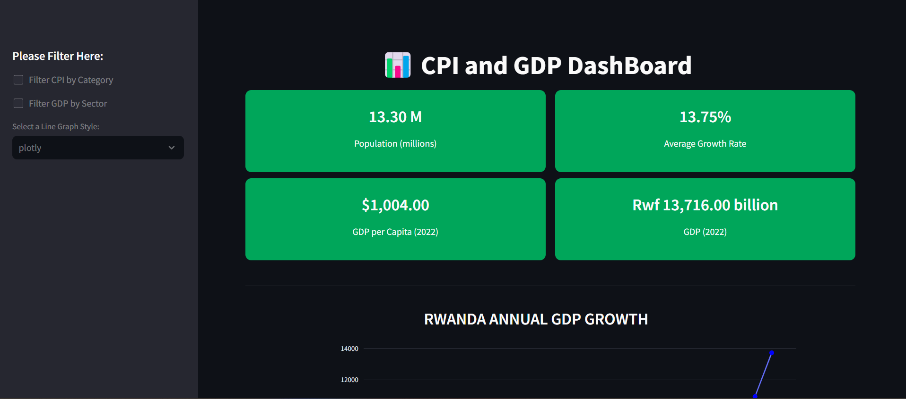

# NISR Data Science Interactive Dashboard

Welcome to the NISR Data Science Hackathon repository! This repository contains code, data, and other resources for the NISR Data Science Hackathon built by DataDynamo team.

## Table of Contents

- [Overview](#overview)
- [Getting Started](#getting-started)
- [Screenshot](#screenshot)
- [Contributing](#contributing)
- [License](#license)

## Overview

This repository is created for the NISR Data Science Hackathon. It provides a starting point for participants to work on data analysis, machine learning, and data visualization projects related to NISR datasets. Whether you're a beginner or an experienced data scientist, you'll find valuable resources here.

## Getting Started

1. Clone this repository to your local machine:

   ```bash
   git clone https://github.com/Makuo67/NISR_Datathon.git
 
## Screenshot



## Contributing
Contributions to this repository are welcomed! If you'd like to contribute code, documentation, or other improvements, please follow these steps:

⋅⋅* Fork the repository to your own GitHub account.
⋅⋅* Create a new branch for your work.
⋅⋅* Make your changes and commit them.
⋅⋅* Push your changes to your GitHub account.
⋅⋅* Create a pull request from your fork's branch to the main repository.
⋅⋅* We'll review your contributions and merge them if they add value to the project.

## License
[](https://opensource.org/licenses/Apache-2.0)